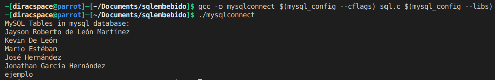
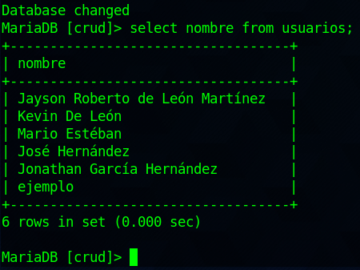

# Práctica SQL embebido usando C

## Requisitos

* Compilador GCC/Clang
* MySQL/MariaDB
* [MySQL-C API](https://dev.mysql.com/doc/c-api/8.0/en/c-api-introduction.html)
* Sólo en Linux - [mysql-common](https://debian.pkgs.org/10/mysql-8.0-amd64/mysql-common_8.0.23-1debian10_amd64.deb.html)

Si están en `Windows`, la instalación de la base de datos agregará las librerías necesarias para el manejo a bajo nivel con el que nosotros trabajaremos. Además, se ocupará instalar el compilador.

Primero, debemos crear un archivo `sql.c` o con algún nombre de su preferencia. Además agregamos librerías importantes.

```c
#include <mysql/mysql.h>
#include <stddef.h>
#include <stdio.h>
#include <stdlib.h>
```

## Creación de modelo

Crearemos una estructura de datos o `struct` como es mejor conocido. De esta forma, podemos invocar el modelo de datos desde cualquier función teniendo así los datos asignados o asignar nuevos datos.

```c
struct connection_details
{
    char *server;
    char *user;
    char *password;
    char *database;
};
```

## Conectando

Lo que haremos es crear una función separada que nos creará una conexión a la base de datos, y esta devolverá un `pointer` o `puntero`. Ahora, esto es básicamente una variable `apuntando` al espacio o registro dentro de nuestro proceso que tiene la conexión a la base de datos. Con esto, nos evitamos tener que estar agregando el código de conexión constantemente.

```c
MYSQL* mysql_connection_setup(struct connection_details mysql_details)
{
    /* creating new instance */
    MYSQL *conn = mysql_init(NULL);

    /* connect to the database with the details */
    if (!mysql_real_connect(conn, mysql_details.server, mysql_details.user,
        mysql_details.password, mysql_details.database, 0, NULL, 0))
    {
        printf("Conection error : %s\n", mysql_error(conn));
        exit(1);
    }
    return conn;
};
```

## Queries

Ahora, para también evitarnos seguir agregando código para nuestras consultas, vamos a crear una función que se encarga solamente de eso. Lo que haremos, es pasarle como parámetros el puntero donde se ubica nuestra conexión y la consulta. Esta devolverá nuestro resultado exitoso.

```c
MYSQL_RES* mysql_perform_query(MYSQL *conn, char *query)
{
    if (mysql_query(conn, query))
    {
        printf("MySQL query error : %s\n", mysql_error(conn));
        exit(1);
    }
    return mysql_use_result(conn);
};
```

## Función main()

Ya que tenemos lo anterior, podemos empezar con nuestro bloque principal de lógica. Creamos una función `main()` y retornamos un 0.

```c
int main()
{
    return 0;
}
```

Ahora, debemos agregar lo esencial de la librería `C API`. Básicamente son punteros que después se les asignará la posición de nuestra creación de instancias.

```c
MYSQL *conn;
MYSQL_RES *res;
MYSQL_ROW row;
```

Tenemos que asignar valores a nuestras propiedas de la `struct` para la información de la base de datos. Así podemos invocar las variables y sus valores en otras funciones.

```c
// assign details to database
struct connection_details mysql_conn_string;
mysql_conn_string.server = "localhost";
mysql_conn_string.user = "operaciones";
mysql_conn_string.password = "prueba";
mysql_conn_string.database = "crud";
```

Procedemos a crear nuestra conexión invocando la función que hemos creado anteriormente, la cual devolverá el puntero y lo asignamos a nuestra instancia local de la función. La cual ahora estará apuntando a ese espacio de memoria.

```c
// connecting to database with details
conn = mysql_connection_setup(mysql_conn_string);
````
Ahora sí, podemos realizar nuestra consulta. Como vemos a continuación, invocamos la función que creamos para realizar una consulta que tomará todos los nombres de nuestra tabla. Este se conoce como `resultset` o una serie de resultados. De la misma forma, hemos creado un puntero que ahora apunta a esa serie de resultados retornados.

```c
res = mysql_perform_query(conn, "select nombre from usuarios;");
```

Necesitamos ahora ver esa serie de resultados. Por lo que pasamos a recorrer todos los valores e imprimirlos a consola.

```c
// display query
printf("MySQL Tables in mysql database:\n");
while ((row = mysql_fetch_row(res)) !=NULL)
{
    printf("%s\n", row[0]);
}
```
Antes de terminar nuestra función, debemos ahora limpiar los punteros para después hacer otra consulta nueva.

```c
// reset objects
mysql_free_result(res);
mysql_close(conn);
```
Ejecución del código

<p align="center">
  
</p>

Información desde la base de datos

<p align="center">
  
</p>